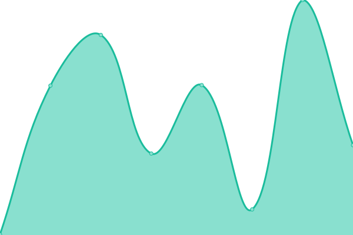

# [📈 Live Status](https://demo.upptime.js.org): <!--live status--> **所有系统都可以正常运行**

This repository contains the open-source uptime monitor and status page for [48493160](https://demo.upptime.js.org), powered by [Upptime](https://github.com/upptime/upptime).

<!--start: status pages-->
<!-- This summary is generated by Upptime (https://github.com/upptime/upptime) -->
<!-- Do not edit this manually, your changes will be overwritten -->
<!-- prettier-ignore -->
| 链接 | 状态 | 历史 | 响应时间 | 正常运行时间 |
| --- | ------ | ------- | ------------- | ------ |
|  [glitch](https://bramble-attractive-wolverine.glitch.me/) | 🟩 正常运行 | [glitch.yml](https://github.com/48493160/upptime/commits/HEAD/history/glitch.yml) | 

 3792毫秒
     
 | 

<a href="https://demo.upptime.js.org/history/glitch">95.77%</a>
    

|  [sandbox](https://ebl1kd-3000.csb.app) | 🟩 正常运行 | [sandbox.yml](https://github.com/48493160/upptime/commits/HEAD/history/sandbox.yml) | 

 1121毫秒
     
 | 

<a href="https://demo.upptime.js.org/history/sandbox">99.84%</a>
    

<!--end: status pages-->

[**Visit our status website →**](https://48493160.github.io/upptime)

## 📄 License

- Powered by: [Upptime](https://github.com/upptime/upptime)
- Code: [MIT](./LICENSE) © [48493160](https://demo.upptime.js.org)
- Data in the `./history` directory: [Open Database License](https://opendatacommons.org/licenses/odbl/1-0/)
